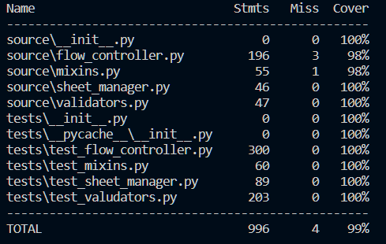

# Spa Booking

Spa Booking is a terminal application designed to simulate the process of booking specific spa services. It offers additional features such as booking cancellations, checking available times for a particular service and date, and accessing information about various services.

The primary objective of this project is to enhance Python skills. Additionally, it involves deploying on a Heroku server, creating unit tests with the Python unittest library, and implementing object-oriented programming principles.

[Link to the live site](https://spa-booking-d13716c85f47.herokuapp.com/)

# Contents

-   [User Experience UX](#user-experience-ux)
    -   [Target Audience](#target-audience)
    -   [User Stories](#user-stories)
    -   [Project Aims](#project-aims)
-   [Flowchart](#flowchart)
-   [Structure](#structure)
    -   [Sheet manager](#sheet-manager)
    -   [Flow manager](#flow-manager)
    -   [Validators](#validators)
    -   [Print manager](#print-manager)
-   [Features](#features)
    -   [Choose option](#choose-option)
    -   ["yes no" feature](#-yes-no--feature)
    -   [Choose date](#choose-date)
    -   [Choose time](#choose-time)
    -   [Get credentials](#get-credentials)
    -   [Change data](#change-data)
    -   [Booking](#booking)
    -   [Booking cancellation](#booking-cancellation)
    -   [Check available time](#check-available-time)
    -   [Service information](#service-information)
-   [Testing](#testing)
    -   [User stories testing](#user-stories-testing)
    -   [Unit testing](#unit-testing)
    -   [PEP8 testing](#pep8-testing)
-   [Bugs](#bugs)
    -   [Fixed Bugs](#fixed-bugs)
    -   [Unfixed Bugs](#unfixed-bugs)
-   [Technologies used](#technologies-used)
-   [Deploying](#deploying)
-   [How to Clone](#how-to-clone)
-   [Credits](#credits)
    -   [Content](#content)
-   [Acknowledgements](#acknowledgements)

<small><i><a href='http://ecotrust-canada.github.io/markdown-toc/'>Table of contents generated with markdown-toc</a></i></small>

# User Experience UX

## Target Audience

This application targets a narrow audience as it lacks a graphical user interface, which could complicate its usability. The audience primarily consists of programmers or companies seeking to integrate a booking system for their products.

[Back to top](#contents)

## User Stories

-   As a user, I want to be able to highlight text in different colors.
-   As a user, I want information to be separated by corresponding groups using different symbols or spaces.
-   As a user, I want to receive notifications or messages for my actions.

[Back to top](#contents)

## Project Aims

The aim of the project is to improve Python skills while also gaining experience in deploying applications on a Heroku server, creating comprehensive unit tests using the Python unittest library, and applying object-oriented programming principles.

[Back to top](#contents)

# Flowchart

The flowchart was created using the [Draw.io](https://www.drawio.com/) software.

# Structure

The application structure has four main branches:

-   Sheet manager - responsible for handling spreadsheet data.
-   Flow manager - responsible for flows of application.
-   Validators - responsible for validating user inputs.
-   Print manager - responsible for printing data to user.

[Back to top](#contents)

## Sheet manager

The `SpaSheet` class manages the spreadsheet received from the API. It creates a sheet attribute that refers to the actual sheet for the API and creates attributes that refer to worksheet objects.

[Back to top](#contents)

## Flow manager

The Spa Booking application comprises four flows (`BookingFlow`, `CancelFlow`, `AvailabilityFlow`, `ServiceInfoFlow`). Each flow corresponds to its own class, with each class inheriting from the basic class `BasicFlow`. This [Object-Oriented Programming (OOP)](<https://www.techtarget.com/searchapparchitecture/definition/object-oriented-programming-OOP#:~:text=Object%2Doriented%20programming%20(OOP)%20is%20a%20computer%20programming%20model,rather%20than%20functions%20and%20logic>) approach enhances the application's flexibility and expandability, while also facilitating adherence to the [Don't Repeat Yourself (DRY)](https://www.digitalocean.com/community/tutorials/what-is-dry-development) principle.

All flows implement `run_flow()` method. The method runs set of methods, one by one, to complete the work of a flow.

## Validators

The validators is place in `validators.py` file. The file has all validators to validate user input.

Ordinarily a validator passed to `input handler()` function. The function call the validator when user pass input.

[Back to top](#contents)

## Print manager

To manage printings I created `PrintMixin` class. The class uses `rich` library to add styles for output and implements methods to print commonly used cases

[Back to top](#contents)

# Features

Each feature include user data validation.

## Choose option

Allow user to take one option from list.

[Back to top](#contents)

## "yes no" feature

Allow user to confirm some action.

[Back to top](#contents)

## Choose date

Allow user to input date for particular service to get schedule or information about the service.

[Back to top](#contents)

## Choose time

Suggest available time for booking and allow user to choose time from list.

[Back to top](#contents)

## Get credentials

Get user credentials like name of phone number.

[Back to top](#contents)

## Change data

Allow user to change data for booking

[Back to top](#contents)

## Booking

User can book service on particular date and time.

[check feature](./docs/BOOKING_FEATURE.md)

## Booking cancellation

User can cancel his bookings by passing name and phone number which he used when book a service.

[check feature](./docs/CANCELLETION_FEATURE.md)

## Check available time

User can check all available times for certain data and service

[check feature](./docs/AVAILABILITY_FEATURE.md)

## Service information

User can get information about a service.

[check feature](./docs/INFORMATION_FEATURE.md)

# Testing

## User stories testing

| Expectations                                                | Realisation                                                                                                                                                                                                                   |
| ----------------------------------------------------------- | ----------------------------------------------------------------------------------------------------------------------------------------------------------------------------------------------------------------------------- |
| **As a user**                                               |                                                                                                                                                                                                                               |
| I want to highlight text in different colors.               | The application allows users to highlight text in various colors, providing a visual emphasis on important information or for categorizing content.                                                                           |
| I want information to be separated by corresponding groups. | Information within the application is separated into distinct groups using different symbols or spaces, ensuring clarity and organization, and making it easier for users to understand and navigate.                         |
| I want to receive notifications or messages for my actions. | Users receive notifications or messages for their actions within the application, ensuring they stay informed about relevant updates or events, providing feedback and guidance throughout their interaction with the system. |

## Unit testing

Unit testing was performed by using built-in python library [unittest](https://docs.python.org/3/library/unittest.html). To run tests navigate to root directory of the project and use commands:

Windows:

`python -m unittest discover tests`

Linux, Unix:

`python3 -m unittest discover tests`

Unittest coverage was checked with `coverage` python library.
To check the test code coverage need to user two commands.

1. This command run all tests under the `coverage` library:

    `coverage run -m unittest`

2. This command show report of coverage.

    `coverage report`

[Back to top](#contents)

## PEP8 testing

PEP8 validation was performed by using [Python linter](https://pep8ci.herokuapp.com/#). To follow PEP8 during development I used VSCode extensions such as [Ruff](https://marketplace.visualstudio.com/items?itemName=charliermarsh.ruff) and [Pylance](https://marketplace.visualstudio.com/items?itemName=ms-python.vscode-pylance).

Check PEP8 validation [here](./docs/PEP8.md)

# Bugs

## Fixed Bugs

-   The "validate_space_separated_integers()" don't intercept input with multiple the same integers [closed issue](https://github.com/Dima-Bulavenko/spa-booking/issues/3).

-   Incorrect canceletion, when multiple bookings selected [closed issue](https://github.com/Dima-Bulavenko/spa-booking/issues/2).

-   Invalid search of bookings for cancellation [closed issue](https://github.com/Dima-Bulavenko/spa-booking/issues/1).

## Unfixed Bugs

The Spa booking application doesn't have unfixed bugs.

[Back to top](#contents)

# Technologies used

-   [Python](https://www.python.org/) - is an interpreted, object-oriented, high-level programming language with dynamic semantics.
-   [rich](https://pypi.org/project/rich/) - python library to add color and style to terminal output.
-   [unittest](https://docs.python.org/3/library/unittest.html) - python built-in library to create unittests.
-   [coverage](https://pypi.org/project/coverage/) - python library to check test coverage
-   [freezegun](https://pypi.org/project/freezegun/) - python library that helps mock datetime module.
-   [gspread](https://) - python interface for working with Google Sheets.
-   [google-auth](https://pypi.org/project/google-auth/) - python library for authentication to Google APIs.
-   [GitHub](https://github.com/) - An online host for web and software development projects. Used to store the repository
    and deploy the finished website.
-   [Git](https://git-scm.com/) - Software for tracking changes to files. Used with GitPod to add, commit and push code
    changes to the repository on GitHub.
-   [Heroku](https://www.heroku.com/) to deploy and host the live app.
-   [Google Spreadsheets API](https://developers.google.com/sheets/api) to store data.
-   [Google Drive](https://developers.google.com/drive) to write an app to process requests to Spreadsheets.
-   [draw.io](https://www.drawio.com/) - for creating flowcharts.

[Back to top](#contents)

# Deploying

The application was hosted using Heroku, a cloud platform designed for building, deploying, and managing apps within containers.

Deployment Steps:

1. Fork or clone this repository.
2. Log in to your Heroku account.
3. Create a new Heroku app.
4. Navigate to the `Settings` tab.
5. Set up environmental variables in the `config vars` section. In this case, it's CREDS(credentials of Google service account) and PORT(value 8000).
6. Configure `buildpacks` in the following order: `python` and `NodeJS`.
7. Set up GitHub integration, selecting the `main` branch in the `Deploy` tab.
8. Click on `Deploy branch` to finalize the deployment process.

# How to Clone

1.  Log into your account on GitHub
2.  Go to the repository of this project [Spa booking](https://github.com/Dima-Bulavenko/spa-booking)
3.  Click on the **code** button, and copy your preferred clone link.
4.  Open the terminal in your code editor and change the current working directory to the location you want to use for the cloned directory.
5.  Type `git clone` into the terminal, paste the link you copied in step 3 and press enter.

[Back to top](#contents)

# Credits

## Content

-   [mocking objects](https://docs.python.org/3/library/unittest.mock.html) for unittesting

-   check test's coverage with python library [coverage](https://coverage.readthedocs.io/en/7.4.3/)

-   mocking datetime.date.today() function with [freezegun](https://stackoverflow.com/questions/4481954/trying-to-mock-datetime-date-today-but-not-working) python library

-   phone number validation was performed by using [phonenumbers](https://pypi.org/project/phonenumbers/) library.

[Back to top](#contents)

# Acknowledgements

I want to convey my immense gratitude to my mentor, [Luke Buchanan](https://www.linkedin.com/in/lukebuchanan67/), for pinpointing my mistakes and providing advice on how to rectify them. Special thanks to my friends who assisted in testing the application, and to the Slack community, always ready to offer valuable tips at any time.

[Back to top](#contents)
