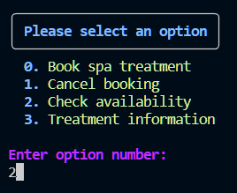
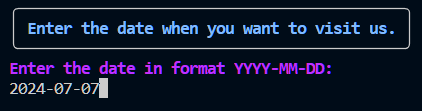
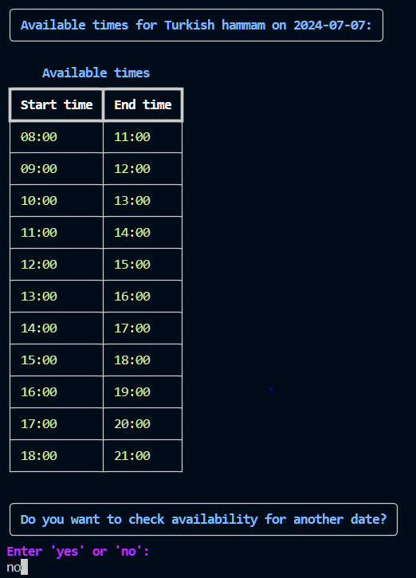

# Check available time

1. Choose availability flow.

2. Choose service to check time.

3. Type date for which to check.

4. Show time and suggest to change date or navigate to main menu.

[Back to README](../README.md#check-available-time)