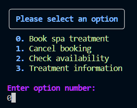
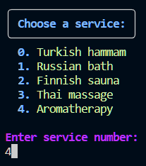
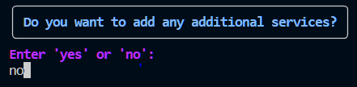
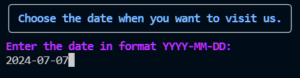
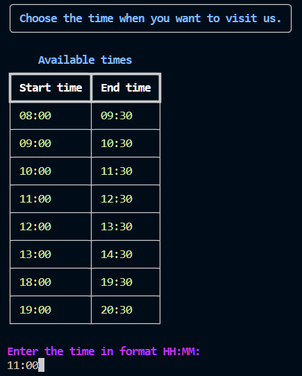
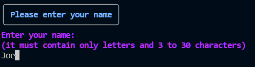
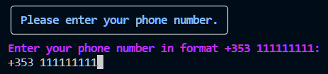
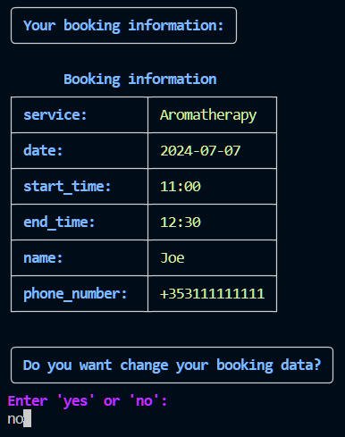

# Booking

1. Choose booking option

2. Choose spa service

3. Suggestion for additional services. If user type "yes", he will be able to choose additional services (the same action as in point 2).

4. Type date when the user is going to visit the spa.

5. Choose available times for visit. First colon is start of service and second one is end of service. Time when a service ends depends on duration of that service.

6. Type name (with this name user will be able to cancel this booking)

7. Type phone number (with this phone number user will be able to cancel this booking)

8. Suggestion for changing booking data.

[Back to README](../README.md#booking)