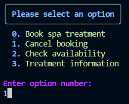
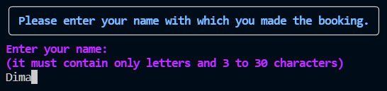
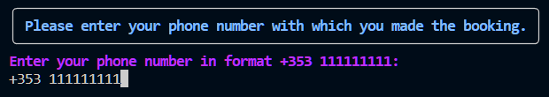
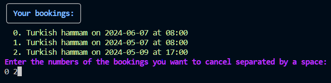

# Booking cancellation

1. Chose cancellation flow.

2. Type name that user pass during booking.

3. Type phone number that user pass during booking.

4. Choose one or more bookings to cancel.

[Back to README](../README.md#booking-cancellation)