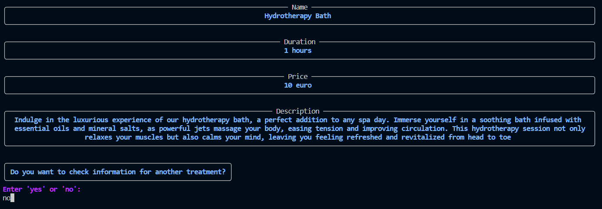

# Service information

1. Choose availability flow.

2. Choose service to get information about.

3. Show information about a service and suggestion to check info about other service or quit.

[Back to README](../README.md#service-information)