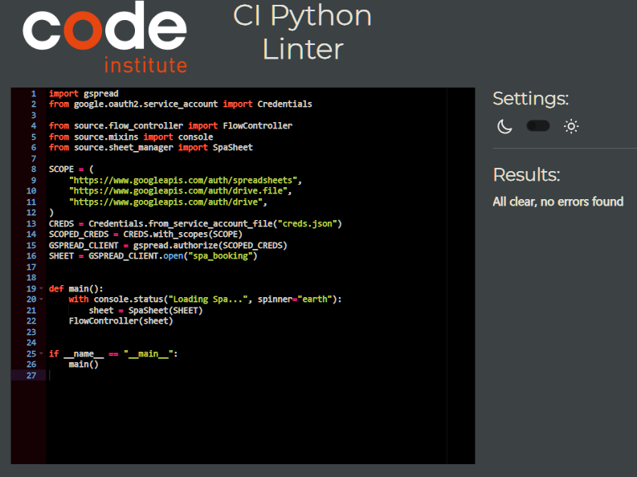
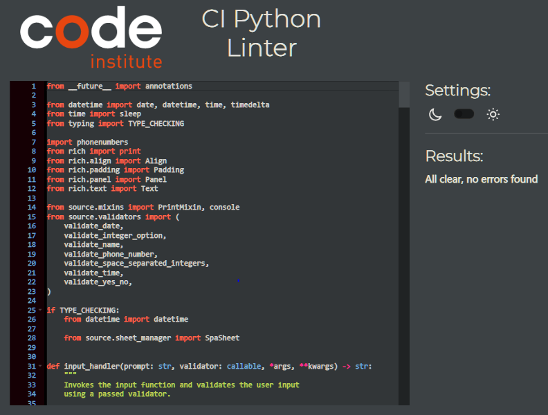
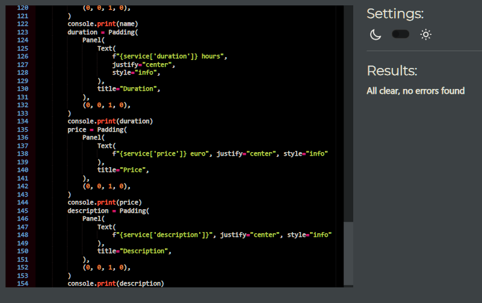
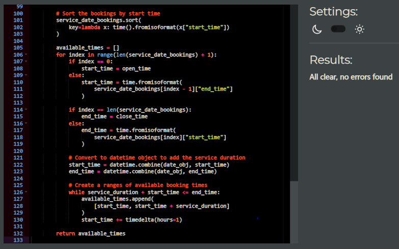
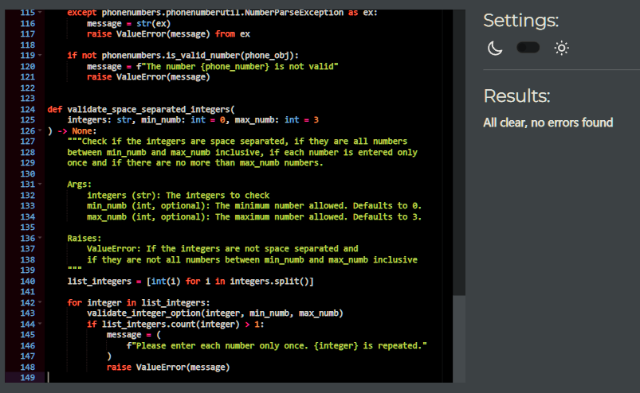
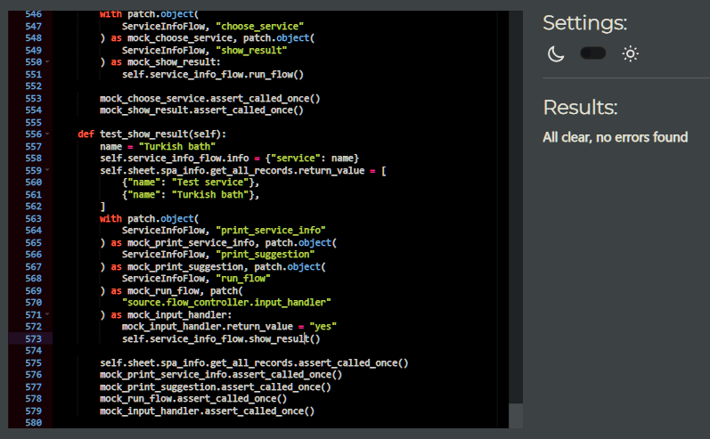
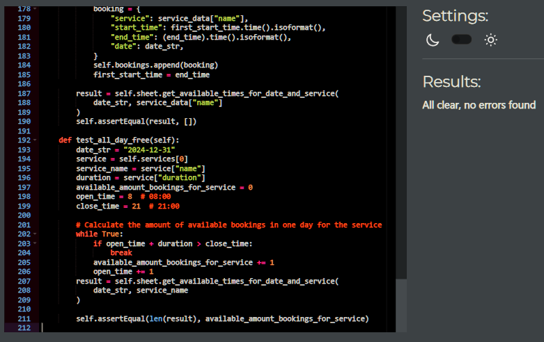
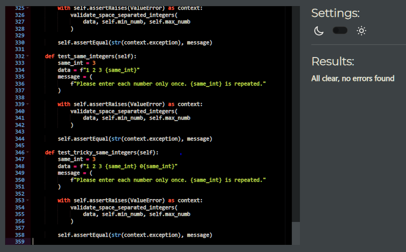

# PEP8 Testing

## `run.py`

[Back to README](../README.md#pep8-testing)

## `flow_controller.py`

[Back to README](../README.md#pep8-testing)

## `mixins.py`

[Back to README](../README.md#pep8-testing)

## `sheet_manager.py`

[Back to README](../README.md#pep8-testing)

## `validators.py`

[Back to README](../README.md#pep8-testing)

## `test_flow_controller.py`

[Back to README](../README.md#pep8-testing)

## `test_mixins.py`

[Back to README](../README.md#pep8-testing)

## `test_sheet_manager.py`

[Back to README](../README.md#pep8-testing)

## `test_validators.py`

[Back to README](../README.md#pep8-testing)
