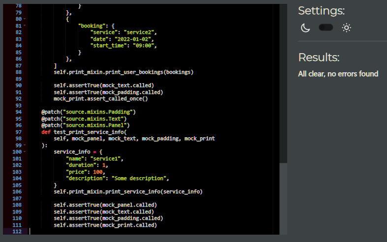

# PEP8 Testing

## `run.py`

## `flow_controller.py`

## `mixins.py`

## `sheet_manager.py`

## `validators.py`

## `test_flow_controller.py`

## `test_mixins.py`

## `test_sheet_manager.py`

## `test_validators.py`

